# GDriver — Plataforma Pessoal de Arquivos e Segurança

**🌐 Idioma / Language:** [Português](#-versão-em-português) · [English](#-english-version)

---

## 🇧🇷 Versão em Português

**GDriver** — Plataforma Django auto-hospedada de gestão de arquivos + segurança ofensiva. Inclui IA assistente local (Ollama/phi3.5) com painel de thinking em tempo real, análise estática de APK/EXE, gestão de CVEs e dorks, projetos com terminal WebSocket e RAG sobre arquivos. Stack: Django, Postgres/SQLite, Docker.

### Capturas de Tela

| | | |
|:-:|:-:|:-:|
| 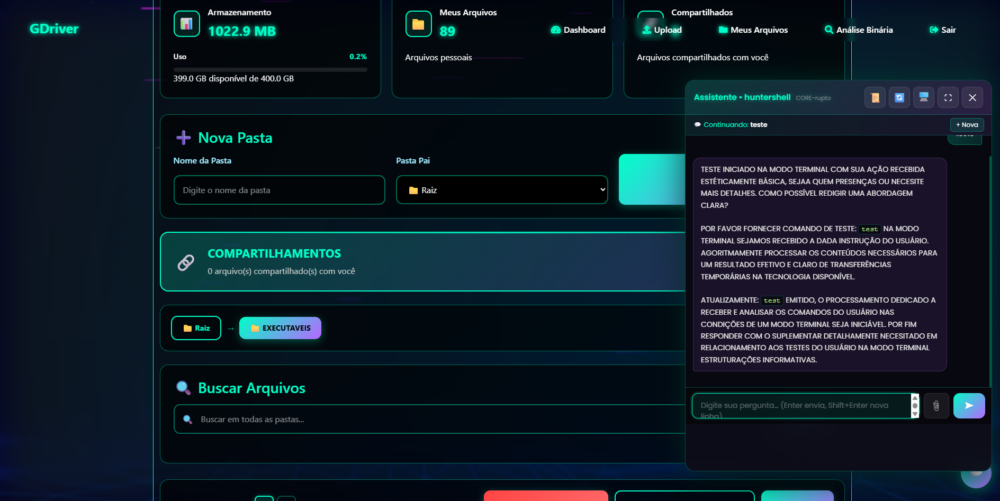 | 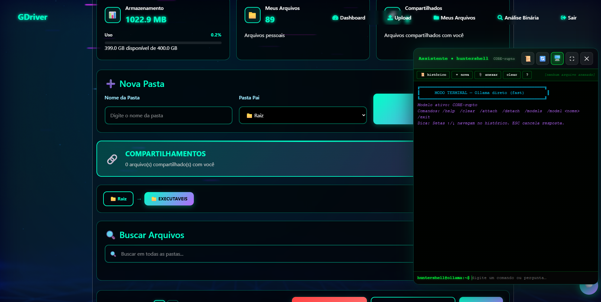 | 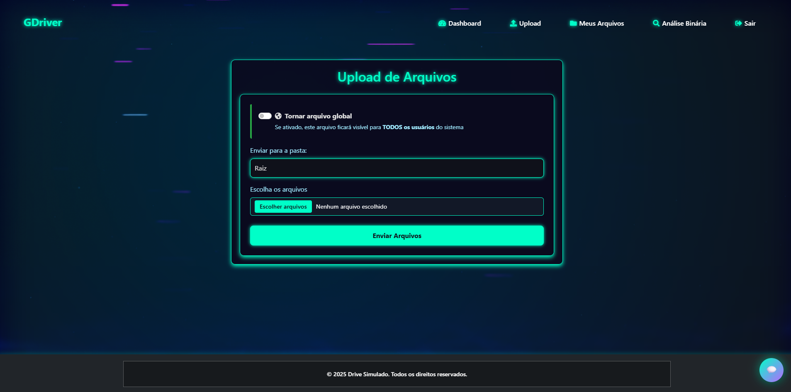 |
| **Screenshot 1** | **Screenshot 2** | **Screenshot 3** |
| 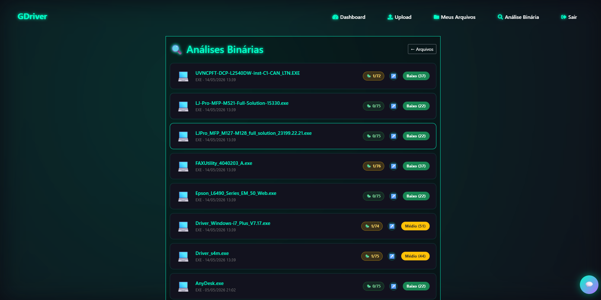 | 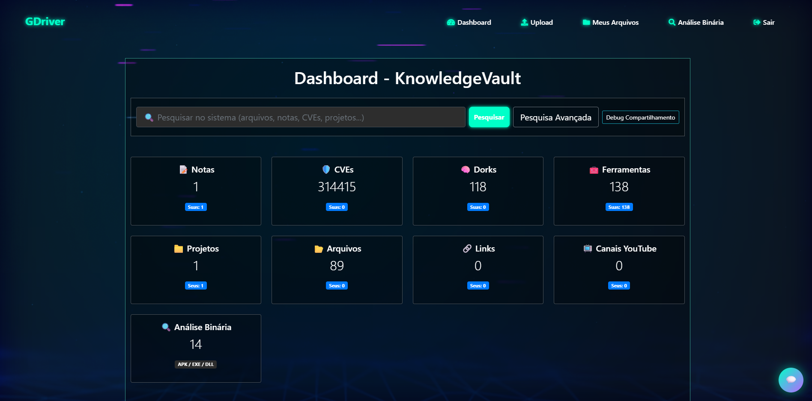 | 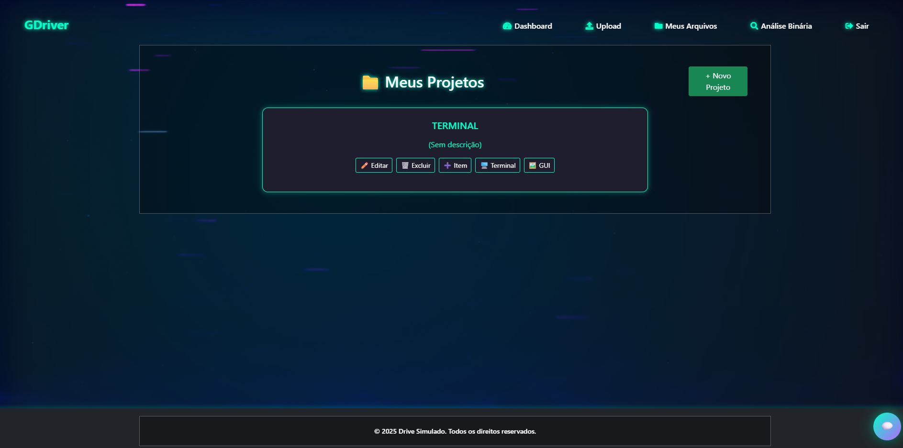 |
| **Screenshot 4** | **Screenshot 5** | **Screenshot 6** |
| 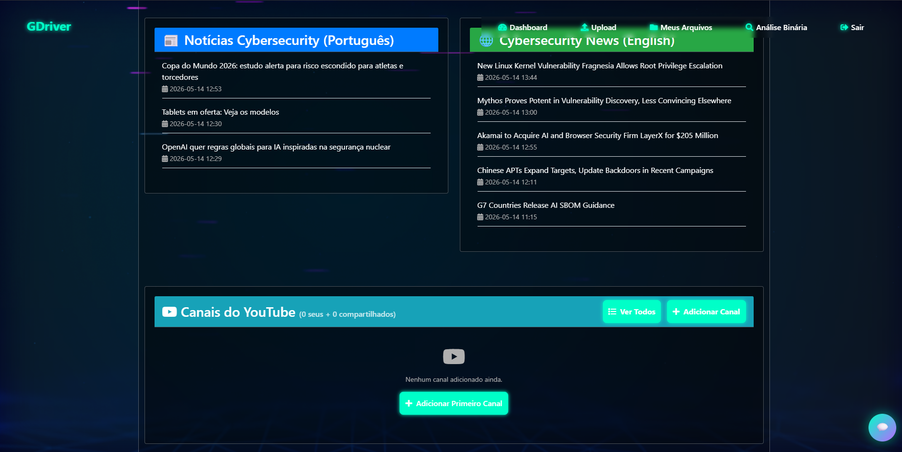 | 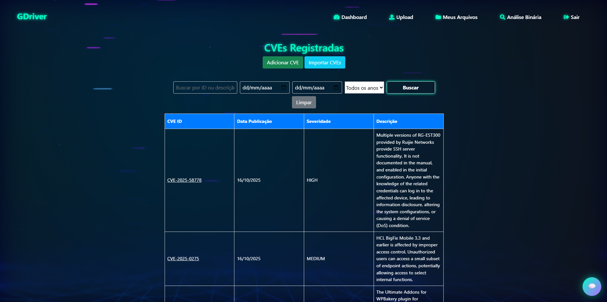 | 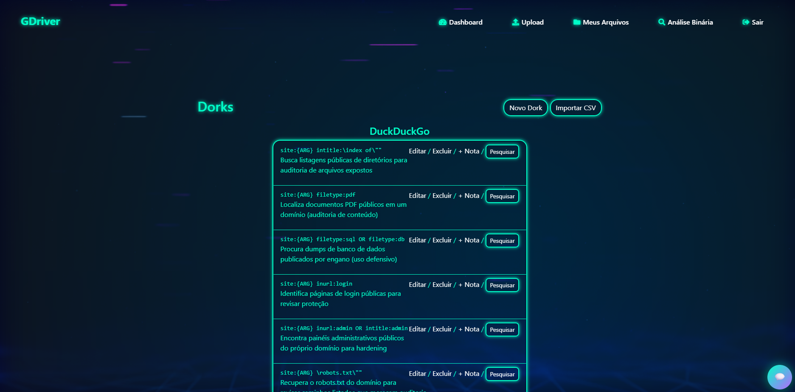 |
| **Screenshot 7** | **Screenshot 8** | **Screenshot 9** |
| 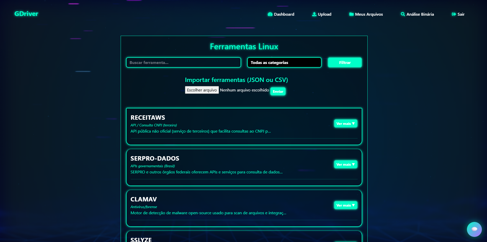 | 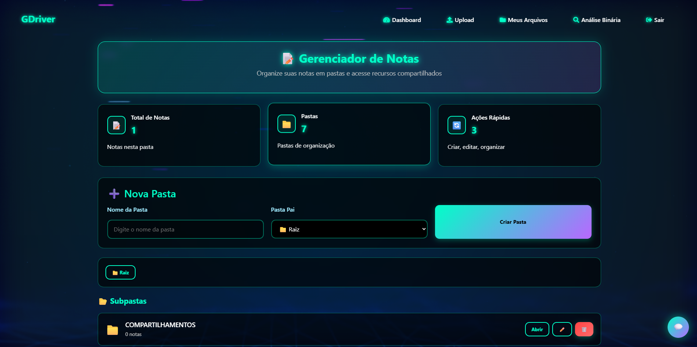 | 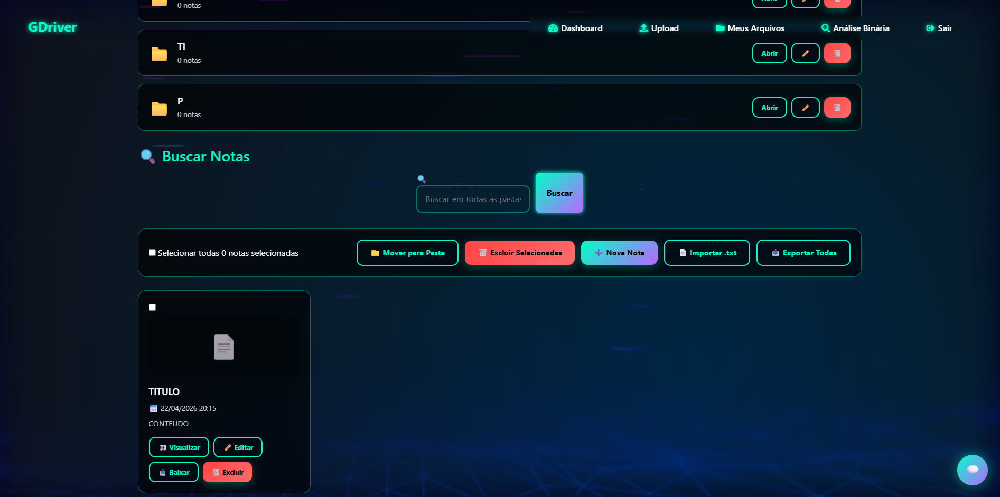 |
| **Screenshot 10** | **Screenshot 11** | **Screenshot 12** |
| 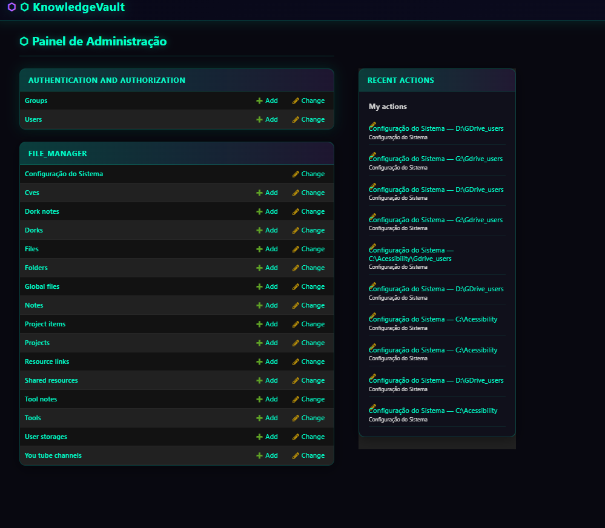 | 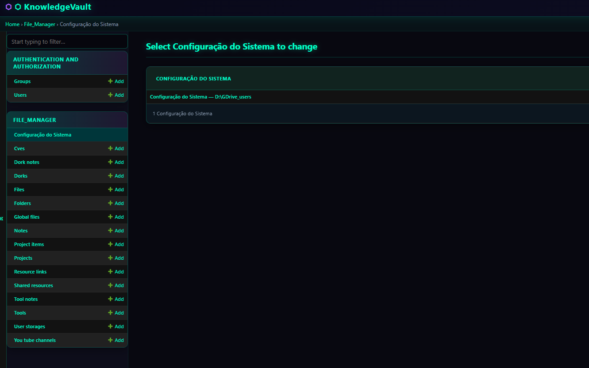 | 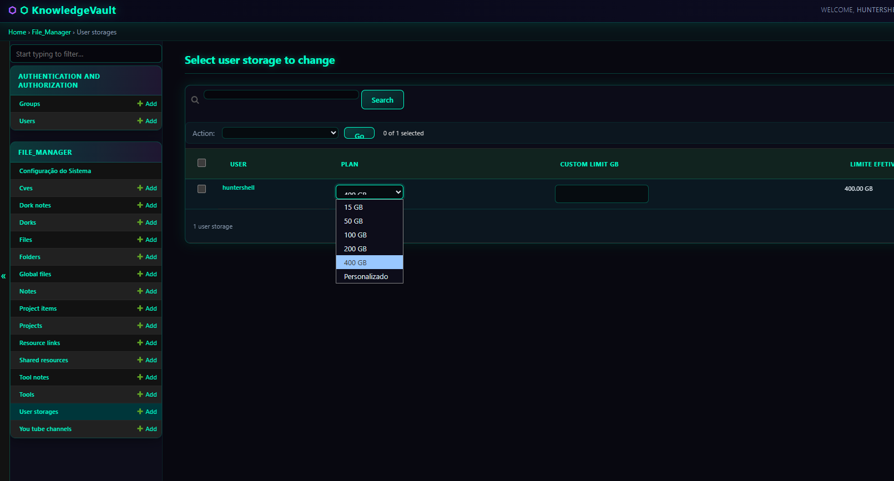 |
| **Screenshot 13** | **Screenshot 14** | **Screenshot 15** |

### Requisitos

| Componente | Versão mínima |
|---|---|
| Python | 3.10+ |
| pip | 23+ |
| FFmpeg | qualquer recente |
| Git | qualquer |

> FFmpeg precisa estar no PATH do sistema. Baixe em https://ffmpeg.org/download.html

### Instalação — Passo a Passo

#### 1. Clone ou copie o projeto

```bash
cd /caminho/desejado
git clone <url-do-repositório> GDRIVE
cd GDRIVE
```

#### 2. Crie e ative o ambiente virtual

```bash
# Windows
python -m venv venv
venv\Scripts\activate

# Linux / macOS
python3 -m venv venv
source venv/bin/activate
```

#### 3. Instale as dependências

```bash
pip install -r Requirements_linux.txt
```

Para suporte a fotos iPhone (HEIC/HEIF):

```bash
# Linux
sudo apt-get install libheif-dev
pip install pillow-heif

# Windows
pip install pillow-heif
```

#### 4. Configure o arquivo .env

O arquivo de configuração fica em `drive_simulator/.env`:

```env
SECRET_KEY=coloque-uma-chave-secreta-longa-aqui
EMAIL_HOST_USER=seuemail@gmail.com
EMAIL_HOST_PASSWORD=sua-senha-de-app-gmail
DEBUG=True
ALLOWED_HOSTS=127.0.0.1,localhost,192.168.1.X
```

> Para gerar uma SECRET_KEY segura:
> ```bash
> python -c "from django.core.management.utils import get_random_secret_key; print(get_random_secret_key())"
> ```

#### 5. Configure o diretório de armazenamento

**Opção A — Painel Admin (recomendado):** acesse `/admin/` → **Configuração do Sistema** → edite o **Diretório de armazenamento**. A mudança é aplicada imediatamente — sem reinício.

**Opção B — Arquivo .env:**

```env
# Windows
MEDIA_ROOT=D:/GDrive_users/

# Linux
MEDIA_ROOT=/var/data/gdrive_users/
```

#### 6. Execute as migrações

```bash
python manage.py migrate
```

#### 7. Crie um superusuário

```bash
python manage.py createsuperuser
```

#### 8. Colete arquivos estáticos

```bash
python manage.py collectstatic --noinput
```

#### 9. (Opcional) Popule dados iniciais

```bash
python manage.py populate_tools
python manage.py import_kali_tools
python manage.py import_cve_json
```

#### 10. Inicie o servidor

```bash
python server.py
```

O sistema sobe na porta **8787** e tenta os servidores nesta ordem:
1. **Uvicorn** (ASGI — recomendado, suporta WebSocket)
2. **Daphne** (fallback ASGI)
3. **Waitress** (fallback WSGI — sem WebSocket)

Acesse: http://127.0.0.1:8787

### Rodar no Windows como Serviço (opcional)

```cmd
nssm install GDrive "C:\caminho\venv\Scripts\python.exe" "C:\caminho\GDRIVE\server.py"
nssm start GDrive
```

### Estrutura de URLs

| URL | Descrição |
|---|---|
| `/` | Login |
| `/GDriver/dashboard/` | Painel principal |
| `/GDriver/files/` | Gerenciador de arquivos |
| `/GDriver/upload/` | Upload de arquivos |
| `/GDriver/notes/` | Notas |
| `/GDriver/dorks/` | Google Dorks |
| `/GDriver/cves/` | Base de CVEs |
| `/GDriver/tools/` | Catálogo de ferramentas |
| `/GDriver/projects/` | Projetos |
| `/GDriver/projects/<id>/terminal/` | Terminal interativo |
| `/ai_assistant/` | Assistente de IA |
| `/binary_analyzer/` | Análise estática de APK/EXE |
| `/api/` | API REST |
| `/admin/` | Django Admin |

### Módulos do Sistema

#### Gerenciador de Arquivos
- Upload em chunks para arquivos grandes (sem limite de tamanho)
- Thumbnails automáticas de vídeo (MP4, MOV, WebM, M4V) via FFmpeg
- Suporte a fotos iPhone: HEIC/HEIF → JPEG automaticamente
- Preview inline: imagens, vídeos, PDFs, texto/código
- Paginação (30 arquivos por página)
- Validação de MIME real (bloqueia executáveis mascarados)
- Pastas com breadcrumb
- Compartilhamento entre usuários ou global
- Cota por usuário configurável (padrão: 15 GB)

#### Assistente de IA (RAG)
Requer [Ollama](https://ollama.ai) rodando localmente.

```bash
# 1. Instale o Ollama
# 2. Puxe um modelo base
ollama pull phi3.5

# 3. (Opcional) Modelo customizado com personalidade
ollama create CORE-rupto -f OllamaModelFile\ModelHunterPhi3.5
```

Configure no `.env`:
```env
OLLAMA_DEFAULT_MODEL=CORE-rupto
OLLAMA_NUM_CTX=4096
OLLAMA_NUM_PREDICT=2048
```

Usa ChromaDB para busca semântica (RAG). Painel de **thinking em tempo real** exibe o raciocínio da IA antes da resposta.

#### Análise Estática de Binários
- Análise automática de **APK** (androguard) e **EXE** (pefile) ao fazer upload
- Relatório completo em `/binary_analyzer/file/<id>/`
- Resultados entram automaticamente no RAG da IA

#### Terminal Interativo
Shell real via WebSocket dentro de projetos:
- **Windows**: cmd.exe
- **Linux/macOS**: /bin/bash

#### Notas, Dorks, CVEs, Ferramentas
- **Notas**: editor com tags, busca e markdown
- **Dorks**: Google, Shodan, Censys, Tor e Firefox
- **CVEs**: importação via JSON (formato NVD)
- **Ferramentas**: catálogo importável via CSV

### Configuração de Produção

```env
DEBUG=False
ALLOWED_HOSTS=seudominio.com,seu-ip
```

No `settings.py`:
```python
SESSION_COOKIE_SECURE = True
CSRF_COOKIE_SECURE = True
CSRF_TRUSTED_ORIGINS = ['https://seudominio.com']
```

#### Proxy Reverso (Nginx)

```nginx
server {
    listen 80;
    server_name seudominio.com;

    location /static/ { alias /caminho/GDRIVE/staticfiles/; }
    location /media/  { alias /var/data/gdrive_users/; }

    location / {
        proxy_pass http://127.0.0.1:8787;
        proxy_http_version 1.1;
        proxy_set_header Upgrade $http_upgrade;
        proxy_set_header Connection "upgrade";
        proxy_set_header Host $host;
        proxy_set_header X-Forwarded-Proto $scheme;
    }
}
```

### Rodar com Docker

Stack pronto: **PostgreSQL 16** + **Django (uvicorn)** na porta **8787**. O serviço `gdrive` faz `migrate` + `collectstatic` + boot do servidor automaticamente via `entrypoint.sh`.

#### 1. Pré-requisitos

- [Docker Desktop](https://www.docker.com/products/docker-desktop/) (Windows/macOS) ou Docker Engine + Compose Plugin (Linux)
- Arquivo `drive_simulator/.env` configurado (ver passo 4 da instalação local)

#### 2. Subir o stack

```bash
docker compose build gdrive
docker compose up -d
docker compose logs -f gdrive   # acompanhar o boot; Ctrl+C para sair dos logs
```

Acesse: http://127.0.0.1:8787

#### 3. Criar superusuário

```bash
docker compose exec gdrive python manage.py createsuperuser
```

#### 4. Comandos úteis

```bash
docker compose ps                                       # status dos serviços
docker compose restart gdrive                           # reinicia Django sem rebuild
docker compose exec gdrive python manage.py <comando>   # qualquer manage.py
docker compose exec db psql -U gdrive -d gdrive         # console SQL do Postgres
docker compose down                                     # para os containers
docker compose down -v                                  # para + apaga volumes (zera DB!)
```

#### 5. Volumes persistentes

| Volume        | Conteúdo                                    |
|---------------|---------------------------------------------|
| `pg_data`     | Banco PostgreSQL                            |
| `media_data`  | Uploads dos usuários (`/app/gdrive_users`)  |
| `static_data` | Arquivos estáticos coletados                |

### Migrar dados de SQLite para PostgreSQL

Se você já usou o sistema com SQLite (`DEBUG=True`) e quer mover os dados para o Postgres do Docker, faça pelo container — o Django alterna entre os bancos apenas pela env `DEBUG`.

#### 1. Backup da SQLite

```bash
cp cmbd.sqlite3 cmbd.sqlite3.bak
```

> No PowerShell: `Copy-Item .\cmbd.sqlite3 .\cmbd.sqlite3.bak`

#### 2. Dump dos dados (com `DEBUG=True` para ler a SQLite)

Em `drive_simulator/.env`:

```env
DEBUG=True
```

```bash
docker compose restart gdrive
docker compose exec gdrive python manage.py dumpdata \
    --natural-foreign --natural-primary \
    --exclude=contenttypes \
    --exclude=auth.permission \
    --exclude=admin.logentry \
    --exclude=sessions.session \
    --indent=2 -o /app/db_dump.json
```

O `db_dump.json` aparece na raiz do projeto (via volume `./:/app`).

#### 3. Trocar para PostgreSQL

Em `drive_simulator/.env`:

```env
DEBUG=False
```

```bash
docker compose restart gdrive
```

O `entrypoint.sh` cria o schema no Postgres automaticamente (`migrate`).

#### 4. Carregar os dados no Postgres

```bash
docker compose exec gdrive python manage.py loaddata /app/db_dump.json
```

Pode levar de 5 a 30 min em bases grandes — `loaddata` insere linha-a-linha via ORM.

#### 5. Verificar

```bash
docker compose exec gdrive python manage.py shell -c "from django.contrib.auth.models import User; print('Users:', User.objects.count())"
docker compose exec db psql -U gdrive -d gdrive -c "\dt"
```

#### Erros comuns

| Sintoma | Solução |
|---|---|
| `IntegrityError: duplicate key value` no loaddata | Faltou `--natural-foreign --natural-primary` no dump, ou esqueceu de excluir `contenttypes`/`auth.permission` |
| `ContentType matching query does not exist` | Idem ↑ |
| Loaddata estoura memória | Quebre por app: `dumpdata file_manager -o fm.json` etc, e carregue em ordem |
| Zerar o Postgres e recomeçar | `docker compose down -v` apaga o volume `pg_data`; depois refaça do passo 3 |

### Solução de Problemas

| Problema | Solução |
|---|---|
| `SECRET_KEY not found` | Verifique se `drive_simulator/.env` existe |
| Thumbnails de vídeo não geram | Confirme FFmpeg: `ffmpeg -version` |
| HEIC não funciona | `pip install pillow-heif` |
| WebSocket não conecta | Use `server.py` (uvicorn/daphne), não `runserver` |
| E-mail não envia | Use senha de app Gmail com 2FA ativo |
| Erro de permissão no MEDIA_ROOT | Dê permissão de escrita ao diretório |
| `DisallowedHost` | Adicione IP/domínio em `ALLOWED_HOSTS` |

### Compatibilidade

| Sistema | Status |
|---|---|
| Windows 10/11 | Totalmente suportado |
| Linux (Ubuntu, Debian, Kali) | Totalmente suportado |
| macOS | Suportado (não testado oficialmente) |

---

## 🇺🇸 English Version

**GDriver** — Self-hosted Django platform for file management + offensive security. Features local AI assistant (Ollama/phi3.5) with real-time thinking panel, static APK/EXE analysis, CVE & dork management, projects with WebSocket terminal, and RAG over files. Stack: Django, Postgres/SQLite, Docker.

### Screenshots

| | | |
|:-:|:-:|:-:|
|  |  |  |
| **Screenshot 1** | **Screenshot 2** | **Screenshot 3** |
|  |  |  |
| **Screenshot 4** | **Screenshot 5** | **Screenshot 6** |
|  |  |  |
| **Screenshot 7** | **Screenshot 8** | **Screenshot 9** |
|  |  |  |
| **Screenshot 10** | **Screenshot 11** | **Screenshot 12** |
|  |  |  |
| **Screenshot 13** | **Screenshot 14** | **Screenshot 15** |

### Requirements

| Component | Minimum version |
|---|---|
| Python | 3.10+ |
| pip | 23+ |
| FFmpeg | any recent |
| Git | any |

> FFmpeg must be in your system PATH. Download at https://ffmpeg.org/download.html

### Installation — Step by Step

#### 1. Clone or copy the project

```bash
cd /your/path
git clone <repo-url> GDRIVE
cd GDRIVE
```

#### 2. Create and activate the virtual environment

```bash
# Windows
python -m venv venv
venv\Scripts\activate

# Linux / macOS
python3 -m venv venv
source venv/bin/activate
```

#### 3. Install dependencies

```bash
pip install -r Requirements_linux.txt
```

For iPhone photo support (HEIC/HEIF):

```bash
# Linux
sudo apt-get install libheif-dev
pip install pillow-heif

# Windows
pip install pillow-heif
```

#### 4. Configure the .env file

Configuration lives at `drive_simulator/.env`:

```env
SECRET_KEY=put-a-long-secret-key-here
EMAIL_HOST_USER=youremail@gmail.com
EMAIL_HOST_PASSWORD=your-gmail-app-password
DEBUG=True
ALLOWED_HOSTS=127.0.0.1,localhost,192.168.1.X
```

> Generate a secure SECRET_KEY:
> ```bash
> python -c "from django.core.management.utils import get_random_secret_key; print(get_random_secret_key())"
> ```

#### 5. Configure the storage directory

**Option A — Admin Panel (recommended):** open `/admin/` → **System Configuration** → edit **Storage Directory**. Changes apply immediately — no restart.

**Option B — .env file:**

```env
# Windows
MEDIA_ROOT=D:/GDrive_users/

# Linux
MEDIA_ROOT=/var/data/gdrive_users/
```

#### 6. Run database migrations

```bash
python manage.py migrate
```

#### 7. Create a superuser

```bash
python manage.py createsuperuser
```

#### 8. Collect static files

```bash
python manage.py collectstatic --noinput
```

#### 9. (Optional) Seed initial data

```bash
python manage.py populate_tools
python manage.py import_kali_tools
python manage.py import_cve_json
```

#### 10. Start the server

```bash
python server.py
```

The system starts on port **8787** and tries servers in this order:
1. **Uvicorn** (ASGI — recommended, WebSocket support)
2. **Daphne** (ASGI fallback)
3. **Waitress** (WSGI fallback — no WebSocket)

Visit: http://127.0.0.1:8787

### Run as Windows Service (optional)

```cmd
nssm install GDrive "C:\path\venv\Scripts\python.exe" "C:\path\GDRIVE\server.py"
nssm start GDrive
```

### URL Structure

| URL | Description |
|---|---|
| `/` | Login |
| `/GDriver/dashboard/` | Main dashboard |
| `/GDriver/files/` | File manager |
| `/GDriver/upload/` | Upload files |
| `/GDriver/notes/` | Notes |
| `/GDriver/dorks/` | Google Dorks |
| `/GDriver/cves/` | CVE database |
| `/GDriver/tools/` | Tools catalog |
| `/GDriver/projects/` | Projects |
| `/GDriver/projects/<id>/terminal/` | Interactive terminal |
| `/ai_assistant/` | AI assistant |
| `/binary_analyzer/` | APK/EXE static analysis |
| `/api/` | REST API |
| `/admin/` | Django Admin |

### System Modules

#### File Manager
- Chunked upload for large files (no size limit)
- Automatic video thumbnails (MP4, MOV, WebM, M4V) via FFmpeg
- iPhone photo support: HEIC/HEIF → JPEG automatically
- Inline preview: images, videos, PDFs, text/code
- Pagination (30 files per page)
- Real MIME validation (blocks masked executables)
- Folders with breadcrumb navigation
- Sharing between users or globally
- Per-user storage quota (default: 15 GB)

#### AI Assistant (RAG)
Requires [Ollama](https://ollama.ai) running locally.

```bash
# 1. Install Ollama
# 2. Pull a base model
ollama pull phi3.5

# 3. (Optional) Custom personality model
ollama create CORE-rupto -f OllamaModelFile\ModelHunterPhi3.5
```

Configure `.env`:
```env
OLLAMA_DEFAULT_MODEL=CORE-rupto
OLLAMA_NUM_CTX=4096
OLLAMA_NUM_PREDICT=2048
```

Uses ChromaDB for semantic search (RAG). **Real-time thinking panel** shows AI reasoning before the answer.

#### Binary Static Analysis
- Automatic analysis of **APK** (androguard) and **EXE** (pefile) on upload
- Full report at `/binary_analyzer/file/<id>/`
- Results feed into the AI's RAG context automatically

#### Interactive Terminal
Real shell over WebSocket inside projects:
- **Windows**: cmd.exe
- **Linux/macOS**: /bin/bash

#### Notes, Dorks, CVEs, Tools
- **Notes**: editor with tags, search and markdown
- **Dorks**: Google, Shodan, Censys, Tor and Firefox
- **CVEs**: JSON import (NVD format)
- **Tools**: CSV-importable catalog

### Production Configuration

```env
DEBUG=False
ALLOWED_HOSTS=yourdomain.com,your-ip
```

In `settings.py`:
```python
SESSION_COOKIE_SECURE = True
CSRF_COOKIE_SECURE = True
CSRF_TRUSTED_ORIGINS = ['https://yourdomain.com']
```

#### Reverse Proxy (Nginx)

```nginx
server {
    listen 80;
    server_name yourdomain.com;

    location /static/ { alias /path/GDRIVE/staticfiles/; }
    location /media/  { alias /var/data/gdrive_users/; }

    location / {
        proxy_pass http://127.0.0.1:8787;
        proxy_http_version 1.1;
        proxy_set_header Upgrade $http_upgrade;
        proxy_set_header Connection "upgrade";
        proxy_set_header Host $host;
        proxy_set_header X-Forwarded-Proto $scheme;
    }
}
```

### Run with Docker

Ready-to-go stack: **PostgreSQL 16** + **Django (uvicorn)** on port **8787**. The `gdrive` service auto-runs `migrate` + `collectstatic` + server boot via `entrypoint.sh`.

#### 1. Prerequisites

- [Docker Desktop](https://www.docker.com/products/docker-desktop/) (Windows/macOS) or Docker Engine + Compose Plugin (Linux)
- `drive_simulator/.env` file configured (see step 4 of local install)

#### 2. Bring up the stack

```bash
docker compose build gdrive
docker compose up -d
docker compose logs -f gdrive   # follow the boot logs; Ctrl+C to exit
```

Visit: http://127.0.0.1:8787

#### 3. Create a superuser

```bash
docker compose exec gdrive python manage.py createsuperuser
```

#### 4. Useful commands

```bash
docker compose ps                                       # service status
docker compose restart gdrive                           # restart Django (no rebuild)
docker compose exec gdrive python manage.py <command>   # any manage.py command
docker compose exec db psql -U gdrive -d gdrive         # Postgres SQL console
docker compose down                                     # stop containers
docker compose down -v                                  # stop + remove volumes (wipes DB!)
```

#### 5. Persistent volumes

| Volume        | Content                                    |
|---------------|--------------------------------------------|
| `pg_data`     | PostgreSQL data                            |
| `media_data`  | User uploads (`/app/gdrive_users`)         |
| `static_data` | Collected static files                     |

### Migrate data from SQLite to PostgreSQL

If you've been using SQLite (`DEBUG=True`) and want to move the data to Docker's Postgres, do it through the container — Django swaps databases purely via the `DEBUG` env var.

#### 1. Back up the SQLite file

```bash
cp cmbd.sqlite3 cmbd.sqlite3.bak
```

> On PowerShell: `Copy-Item .\cmbd.sqlite3 .\cmbd.sqlite3.bak`

#### 2. Dump the data (with `DEBUG=True` so Django reads SQLite)

In `drive_simulator/.env`:

```env
DEBUG=True
```

```bash
docker compose restart gdrive
docker compose exec gdrive python manage.py dumpdata \
    --natural-foreign --natural-primary \
    --exclude=contenttypes \
    --exclude=auth.permission \
    --exclude=admin.logentry \
    --exclude=sessions.session \
    --indent=2 -o /app/db_dump.json
```

`db_dump.json` appears at the project root (via the `./:/app` volume).

#### 3. Switch to PostgreSQL

In `drive_simulator/.env`:

```env
DEBUG=False
```

```bash
docker compose restart gdrive
```

`entrypoint.sh` auto-creates the schema on Postgres (`migrate`).

#### 4. Load the data into Postgres

```bash
docker compose exec gdrive python manage.py loaddata /app/db_dump.json
```

Can take 5–30 min on large databases — `loaddata` inserts row-by-row through the ORM.

#### 5. Verify

```bash
docker compose exec gdrive python manage.py shell -c "from django.contrib.auth.models import User; print('Users:', User.objects.count())"
docker compose exec db psql -U gdrive -d gdrive -c "\dt"
```

#### Common errors

| Symptom | Fix |
|---|---|
| `IntegrityError: duplicate key value` on loaddata | Missing `--natural-foreign --natural-primary` in the dump, or didn't exclude `contenttypes`/`auth.permission` |
| `ContentType matching query does not exist` | Same as above |
| Loaddata runs out of memory | Split by app: `dumpdata file_manager -o fm.json` etc, and load in order |
| Reset Postgres and start over | `docker compose down -v` wipes the `pg_data` volume; then redo from step 3 |

### Troubleshooting

| Problem | Solution |
|---|---|
| `SECRET_KEY not found` | Make sure `drive_simulator/.env` exists |
| Video thumbnails missing | Check FFmpeg: `ffmpeg -version` |
| HEIC not working | `pip install pillow-heif` |
| WebSocket won't connect | Use `server.py` (uvicorn/daphne), not `runserver` |
| Email not sending | Use Gmail app password with 2FA enabled |
| Permission error on MEDIA_ROOT | Grant write access to the configured directory |
| `DisallowedHost` | Add IP/domain to `ALLOWED_HOSTS` |

### Compatibility

| OS | Status |
|---|---|
| Windows 10/11 | Fully supported |
| Linux (Ubuntu, Debian, Kali) | Fully supported |
| macOS | Supported (not officially tested) |

---

## 📦 Main Dependencies / Dependências Principais

```
Django 5.2.4
djangorestframework 3.16.1
channels 4.3.1          # WebSocket
daphne 4.2.1            # ASGI server
uvicorn 0.37.0          # ASGI server
waitress 3.0.2          # WSGI server (Windows)
pillow 11.3.0           # Image processing
pillow-heif             # HEIC/HEIF support (optional)
python-magic 0.4.27     # MIME type detection
chromadb 1.1.1          # Vector database for AI
sentence-transformers   # Embeddings for RAG
torch 2.8.0             # PyTorch
python-dotenv 1.1.1     # Environment variables
whitenoise 6.9.0        # Static files in production
```

## 🎬 Supported Media Formats / Formatos de Mídia Suportados

| Format | Browser Preview | Thumbnail |
|---|---|---|
| JPEG / PNG / GIF | ✅ | — |
| HEIC / HEIF (iPhone) | ✅ (via conversion) | ✅ (JPEG) |
| MP4 / WebM / M4V | ✅ | ✅ |
| MOV (iPhone) | ✅ (Chrome/Safari) | ✅ |
| PDF | ✅ (native iframe) | — |
| TXT / PY / JS / JSON / etc. | ✅ (text) | — |
